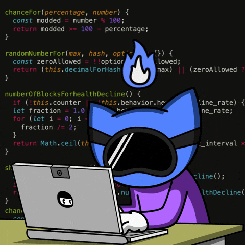

  

<table style="width:100%; border: none;">
  <tr>
    <td width="70%">
      <h1>Olá, sou Gustavo 👋</h1>
      

        Sou desenvolvedor Backend com foco em Python, atualmente estudando Django e Flask no desenvolvimento de APIs e aplicações web; E AWS para deploy, infraestrutura, hospedagem,etc.
        Tenho experiência com PostgreSQL para modelagem e MongoDB.

Utilizo Linux como ambiente principal de desenvolvimento; Busco escrever soluções limpas, e seguir rumo a carreira de  <strong>DevOps</strong>, por maior vontade de trabalhar com infra; Tenho familiaridade com terminal, scripts em Bash, automação com Python e gerenciamento de permissões e processos; É o que mais tenho gostado de fazer ultimamente.

Estou em constante aprendizado, aplicando na prática novos conceitos através de projetos próprios, com o objetivo de evoluir tecnicamente e construir sistemas que resolvam problemas reais.

    </td>
    <td width="30%" align="center">
      
    </td>
  </tr>
</table>

    
    
 

<h1> Tecnologias & Ferramentas </h1>

  
 <b>Conhecimentos adicionais: </b>

    
    
 

<h1>🚀 Projetos em Destaque</h1>
 <table>
    <tr>
      <td width="65%">
        <h3> Laboratório de Redes e Firewall com Linux </h3>
        <b>Descrição:</b> Ambiente virtual com duas VMs (KVM) configuradas em rede interna isolada. Implementação de regras de firewall com iptables para controle de acesso SSH e testes de conectividade com ping e nmap.  
<b>Stack:</b> Linux (Ubuntu Server), KVM, iptables, nmap  
        
🔗 https://github.com/amoras200/lab-rede-firewall
    </tr>
  </table>

---
<table>
    <tr>
      <td width="65%">
        <h3> Monitor de Logs de Autenticação </h3>
        <b>Descrição:</b> Script em Python que analisa logs de autenticação (`/var/log/auth.log`), identifica tentativas de login falhas e alerta quando um IP excede o limite configurável. Demonstra automação, análise de logs e conceitos de segurança.  
<b>Stack:</b> Python, argparse, regex, Linux 
        
🔗 https://github.com/amoras200/monitor_log
    </tr>
  </table>

---

<table>
    <tr>
      <td width="65%">
        <h3> Monitor de Recursos do Sistema</h3>
        <b>Descrição:</b> Script em Python que monitora CPU, memória, disco e processos em tempo real, disparando alertas quando os limites são ultrapassados. Útil para observabilidade e detecção precoce de problemas. 
<b>Stack:</b> Python, psutil, argparse, Linux
        
🔗 https://github.com/amoras200/monitor_recursos
    </tr>
  </table>

---

 <table>
    <tr>
      <td width="65%">
        <h3 align="center"> </h3>
        
NutriAção: 

        
Projeto Acadêmico desenvolvido afim de conectar excedentes a potenciais doadores.

        
🔗 <strong>GitHub:</strong> 
        <a href="https://github.com/NutriAcao/NutriAcao">github.com/NutriAcao/NutriAcao</a>

        
🛠️ <strong>Stack:</strong>

        <ul>
          <li>Node</li>
          <li>JavaScript</li>
          <li>PostgreSQL</li>
          <li>HTML</li>
          <li>CSS</li>
        </ul>
      </td>
      <td width="40%" align="center">
        
      </td>
    </tr>
  </table>

    
 

<h1> 📊 GitHub Stats </h1>  

  
  

<h1>📬 Vamos nos conectar?</h1>

    
    
 

  

 

    
    
    
 

